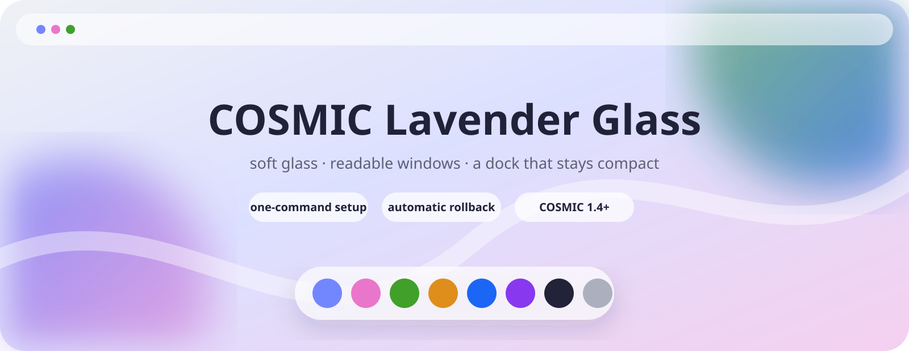
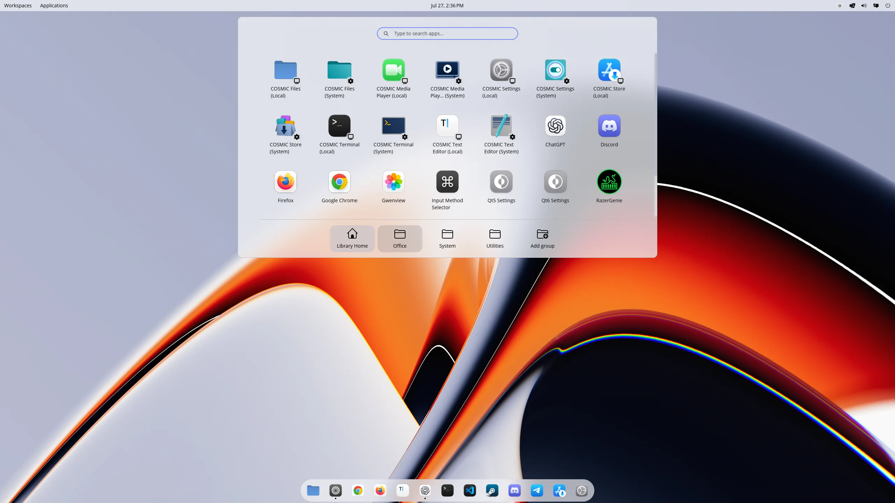
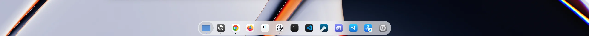
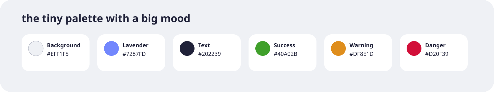

<p align="center">
  
</p>

<p align="center">
  A colorful, calm COSMIC desktop with soft glass surfaces, readable windows,
  and a floating dock that refuses to become a giant bar.
</p>

<p align="center">
  <a href="../../releases/download/v1.1.0/cosmic-lavender-glass-v1.1.0.zip"><strong>Download the complete theme</strong></a>
  ·
  <a href="../../releases/download/v1.1.0/cosmic-lavender-glass-5120x1440.png">Wallpaper</a>
  ·
  <a href="../../releases/download/v1.1.0/cosmic-lavender-glass.ron">RON theme</a>
</p>

## Install it ✨

Copy, paste, enjoy:

```bash
git clone --depth 1 https://github.com/omrlw/cosmic-lavender-glass.git
cd cosmic-lavender-glass
./install.sh
```

That is it. The installer applies the theme, wallpaper, dock, and MacTahoe
icons. It never uses `sudo`, creates a backup first, and rolls everything back
automatically if an installation step fails.

> Requires COSMIC Desktop 1.4 or newer.

## What lands on your desktop

- 💜 Catppuccin Latte Lavender colors.
- 🫧 Medium blur on the panel, applets, and system surfaces.
- 📖 Opaque app windows so text stays comfortable to read.
- 🪟 Rounded corners, 8 px inner gaps, and a lavender active-window hint.
- 🛟 A floating 90% opacity dock that stays compact when apps are maximized.
- 🖼️ An original 5120×1440 lavender wallpaper for dual 1440p displays.

## See it in action



### The dock stays small



### The included wallpaper


The working-desktop screenshots may show a different wallpaper. The lavender
image above is the wallpaper actually included with this project.



## Changed your mind?

One command puts the previous desktop configuration back:

```bash
./uninstall.sh
```

MacTahoe is removed only when this project installed it. If it was already on
the machine, it stays there.

<details>
<summary><strong>Useful options</strong></summary>

Choose one display for the dock:

```bash
./install.sh --output DP-1
```

Keep the current icons and avoid the MacTahoe download:

```bash
./install.sh --skip-icons
```

See what would change without applying it:

```bash
./install.sh --dry-run
```

List or restore an older backup:

```bash
./uninstall.sh --list-backups
./uninstall.sh --backup BACKUP_ID
```

</details>

<details>
<summary><strong>Quick fixes</strong></summary>

**Dock on the wrong screen?** Open **COSMIC Settings → Displays**, copy the
connector name, and run `./install.sh --output NAME`.

**MacTahoe could not download?** Run `./install.sh --skip-icons`. The theme,
wallpaper, and dock work without it.

**Want a completely clean return?** Run `./uninstall.sh`.

</details>

## Inside the box

```text
assets/       previews and artwork
config/       dock reference
theme/        standalone COSMIC RON theme
wallpapers/   original 5120×1440 wallpaper
install.sh    safe installer
uninstall.sh  one-command restore
```

## Credits

Theme foundations come from
[Catppuccin for COSMIC](https://github.com/catppuccin/cosmic-desktop) at
[`95e8109`](https://github.com/catppuccin/cosmic-desktop/commit/95e81098042dd2102f0b258f6990f886c5759692).
Optional icons come directly from
[MacTahoe](https://github.com/vinceliuice/MacTahoe-icon-theme) at
[`77eebfc`](https://github.com/vinceliuice/MacTahoe-icon-theme/commit/77eebfcdb5bf7074a2877eaee63f1bf48a994d5e).

This is an independent community project, not an official System76,
Catppuccin, or MacTahoe release.

Scripts and configuration are [MIT licensed](LICENSE). The original lavender
wallpaper is [CC BY 4.0](LICENSE-WALLPAPER). See
[third-party notices](THIRD_PARTY_NOTICES.md) for attribution.
